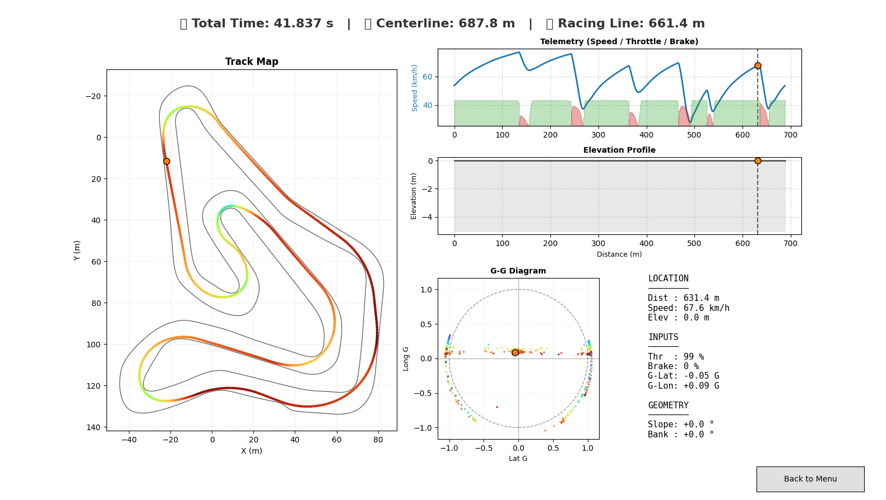

# ApexOptimizer: Physics-Based 3D Racing Line Solver


**ApexOptimizer** 是一个基于物理模型的赛车理论最优路径规划器。与传统的几何寻路不同，本项目采用非线性规划（NLP）技术，结合车辆动力学模型（质点模型 + 摩擦圆约束），在考虑赛道 **3D 几何特征（坡度 Slope 与 倾角 Banking）** 的前提下计算时间最优轨迹。



## 核心特性 (Features)

*   **3D 赛道物理支持**：完整考虑赛道高程变化（Elevation）和横向倾角（Banking）对轮胎载荷及重力分量的影响。
*   **非线性优化求解**：基于 `CasADi` 和 `Ipopt` 求解器，直接优化控制输入（加加速度、转向角速度）。
*   **多分辨率策略**：自动采用 "Coarse-to-Fine" 策略，先在低精度网格快速寻找可行解，再进行高精度细化，提高收敛率。
*   **可视化仪表盘**：内置 Matplotlib 交互式仪表盘，展示速度曲线、G-G 图、油门/刹车开度及遥测数据。
*   **丰富的工具箱**：
    *   `Track Builder`: 图形化赛道绘制工具，支持从卫星图描点生成 3D 赛道。
    *   `Vehicle Editor`: 车辆参数编辑器，支持 F1、GT3、卡丁车等多种车型预设。

## 安装与环境 (Installation)

本项目基于 Python 3.8+ 开发。建议使用 Anaconda 或 venv 创建虚拟环境。

1. **克隆仓库**
   ```bash
   git clone https://github.com/SR9434/ApexOptimizer.git
   cd ApexOptimizer
   ```

2. **安装依赖**
   ```bash
   pip install -r requirements.txt
   ```
   *核心依赖包括：`numpy`, `scipy`, `matplotlib`, `casadi`*

## 快速开始 (Quick Start)

### 方式一：图形化启动器 (推荐)
直接运行主程序，将唤起 GUI 界面，可选择赛道、车辆并调整精度。

```bash
python main.py
```

### 方式二：命令行模式
适合批量测试或无头模式运行。

```bash
python main.py --no-gui --track tracks/karting1.csv --car cars/karting.json --precision high
```

## 项目结构 (Structure)

```text
ApexOptimizer/
├── main.py                 # 程序入口
├── src/                    # 核心源代码
│   ├── optimizer.py        # 最优控制问题构建与求解 (CasADi/Ipopt)
│   ├── model.py            # 车辆动力学模型
│   ├── track.py            # 3D 赛道物理层
│   └── dashboard.py        # 结果可视化
├── tools/                  # 实用工具
│   ├── track_builder.py    # 赛道绘制工具
│   └── vehicle_editor.py   # 车辆参数编辑器
├── tracks/                 # 赛道文件 (.csv)
├── cars/                   # 车辆参数 (.json)
└── results/                # 优化结果保存位置
```

## 数学建模与物理原理 (Mathematical Modeling & Physics)

ApexOptimizer 采用基于**曲线坐标系 (Curvilinear Coordinates)** 的单轨车辆模型，构建了一个非线性规划 (NLP) 问题。求解器通过正交配置法 (Orthogonal Collocation) 将连续时间的最优控制问题离散化，求解赛道 $s$ 域上的时间最优解。

### 1. 坐标系与状态空间
我们将车辆运动投影到赛道中心线坐标系 $(s, n)$ 中：
*   **自变量**: $s$ (赛道中心线弧长)
*   **状态向量 $\mathbf{x}$**: $[n, \xi, v]^T$
    *   $n$: 车辆相对于中心线的横向偏差 (Lateral Deviation)
    *   $\xi$: 车辆航向角相对于中心线切向的偏差 (Heading Error)
    *   $v$: 车辆合速度 (Velocity)
*   **控制输入 $\mathbf{u}$**: $[\kappa, a_{long}]^T$
    *   $\kappa$: 路径曲率 (Path Curvature, 近似对应转向输入)
    *   $a_{long}$: 纵向运动学加速度 (Longitudinal Acceleration)

### 2. 系统动力学方程 (Equations of Motion)
在空间域 $s$ 上，车辆的运动微分方程定义为：

$$
\begin{aligned}
\frac{dn}{ds} &= S_f \cdot \tan(\xi) \\
\frac{d\xi}{ds} &= \kappa \frac{S_f}{\cos(\xi)} - \kappa_{ref}(s) \\
\frac{dv}{ds} &= \frac{a_{long} \cdot S_f}{v \cos(\xi)} \\
\frac{dt}{ds} &= \frac{S_f}{v \cos(\xi)}
\end{aligned}
$$

其中 $S_f = 1 - n \cdot \kappa_{ref}(s)$ 为空间缩放因子，$\kappa_{ref}(s)$ 为赛道中心线的几何曲率。目标函数为最小化总时间 $J = \int_{0}^{L} \frac{dt}{ds} ds$。

### 3. 3D 准静态力学平衡 (Quasi-Static Equilibrium in 3D)
本项目引入了高精度的 3D 赛道模型，考虑**纵坡 (Slope, $\theta$)** 和 **横坡 (Banking, $\phi$)** 对车辆受力的显著影响：

*   **空气动力学载荷**:
    $$ F_{aero\_down} = \frac{1}{2} \rho C_l A v^2, \quad F_{drag} = \frac{1}{2} \rho C_d A v^2 $$

*   **轮胎垂向载荷 ($F_z$)**:
    结合重力分量与气动下压力：
    $$ F_z(s) = m g \cos(\theta) \cos(\phi) + F_{aero\_down} $$

*   **合力需求分析 (Inverse Dynamics)**:
    为了维持运动学状态 $\mathbf{x}$ 和输入 $\mathbf{u}$，轮胎必须产生的合力为：
    *   **横向力需求**: 离心力 + 重力横向分量
        $$ F_{lat\_req} = m v^2 \kappa + m g \sin(\phi) $$
        *(注: 正向 Banking 会提供向心分力，显著提高过弯极限)*
    *   **纵向力需求**: 惯性力 + 空气阻力 + 重力坡度分量
        $$ F_{long\_req} = m a_{long} + F_{drag} + m g \sin(\theta) $$

### 4. 约束条件 (Constraints)
优化器在求解过程中严格遵守以下物理边界：

1.  **摩擦圆约束 (Kamm's Friction Circle)**:
    轮胎产生的总合力不能超过物理极限：
    $$ (F_{lat\_req})^2 + (F_{long\_req})^2 \leq (\mu F_z \cdot \eta_{util})^2 $$
    其中 $\mu$ 为路面摩擦系数，$\eta_{util}$ 为安全裕度系数。

2.  **动力单元特性 (Powertrain Limits)**:
    $$ F_{long\_req} \leq F_{max\_tractive} $$
    $$ F_{long\_req} \cdot v \leq P_{max\_power} $$

3.  **几何边界**:
    $$ -w_{right}(s) + \delta \leq n(s) \leq w_{left}(s) - \delta $$

## 许可证 (License)

本项目采用 **GNU GPL v3.0** 许可证。
这意味着您可以自由阅读、修改和分发代码，但**如果您基于本项目发布了新的软件，该软件也必须开源**。

---
*Created by SR9434*
```